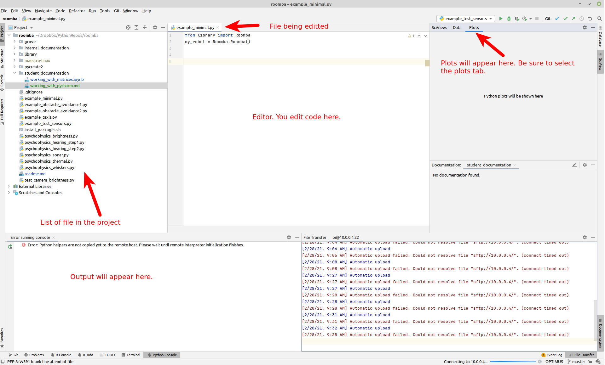
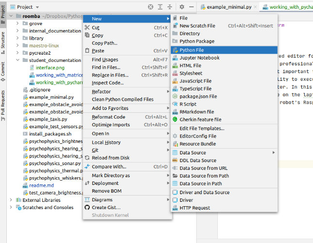
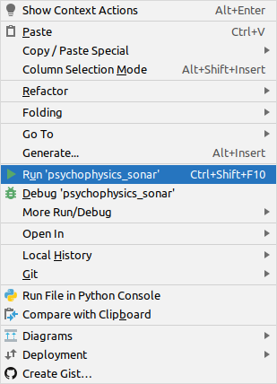
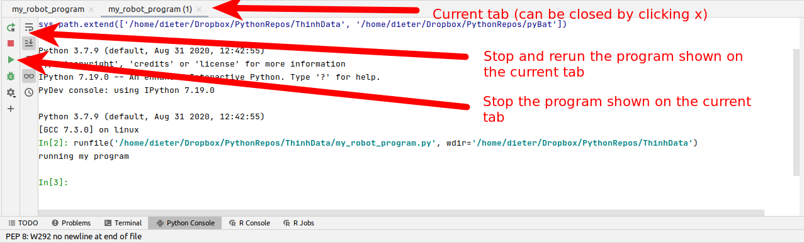
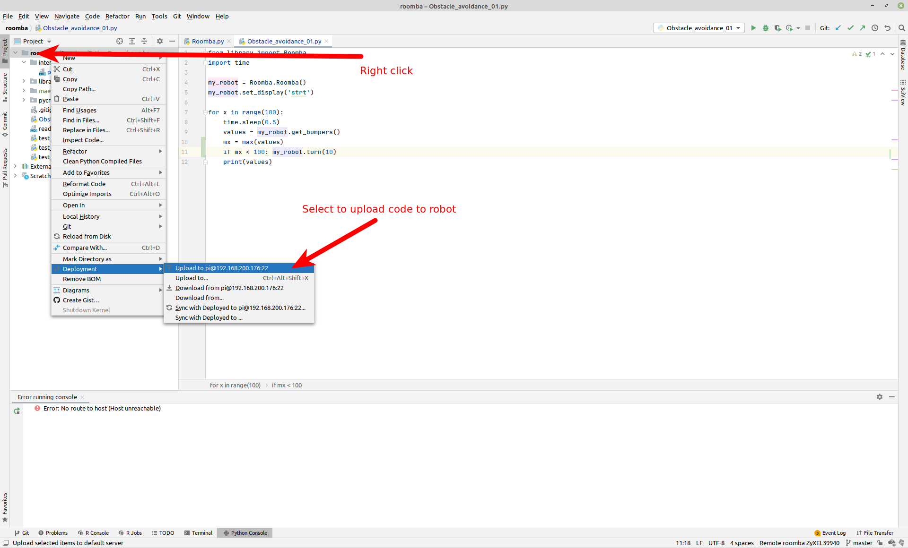

# Working with Pycharm

## What is Pycharm?

Pycharm is an advanced editor for Python. I has many professional functions. The most important for our purpose is the ability to execute code on a remote computer. In this course, you will edit code on the laptop but it will run on the robot's Raspberry Pi.

## Interface

The image below shows the main elements of the Pycharm interface.

 

+ **Opening** an existing file is done by double clicking its file name in the list of project files.

+ **Creating a new file** is done by right clicking `roomba` > `new file` > `python file`. This will bring up a dialog box asking you to name your file. This is shown in the image below. You should create your own files. Do not use my files to write your code. *These might be overwritten if I have to update the robot code. You can copy-paste code from my examples to your files.*

  

+ **Running code** is done by right clicking in the body of the file and selecting `run 'xxx'`, with `xxx` your filename. This is shown below.

  

+ **Stopping  and/or Re-running your code** can be done from the control that appear when running your code. If you run your code as indicated above, PyCharm will start a new console to run the program in. This console comes with its own control buttons, as shown below.

# Dealing with issues

Sometimes, especially when restarting the raspberry pi, you might get an error saying that `no such file or directory can be found`. An example of such error is shown below. This is usually because PyCharm has not yet uploaded the required files to your robot (Raspeberry Pi).

You can upload the files manually by right clicking `roomba` > `deployment` > `upload to xxx`, with `xxx` your robot's name. See the screenshot below. If this does not solve the problem, you will have to ask for my help.

